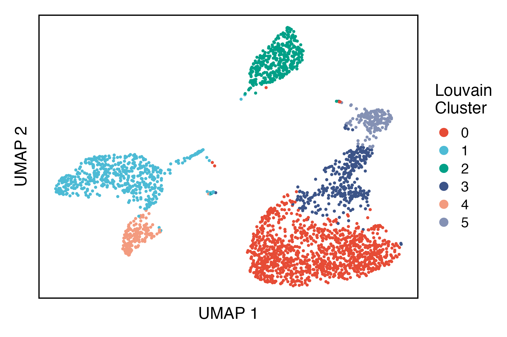
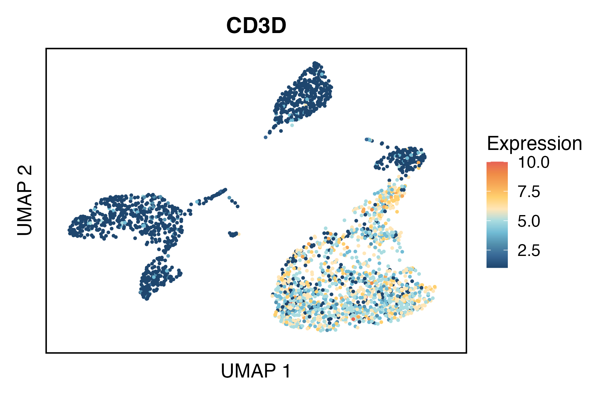
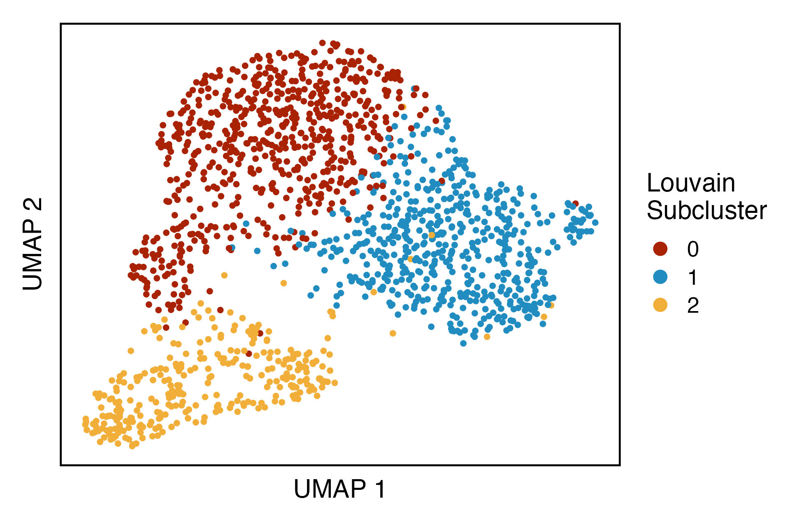
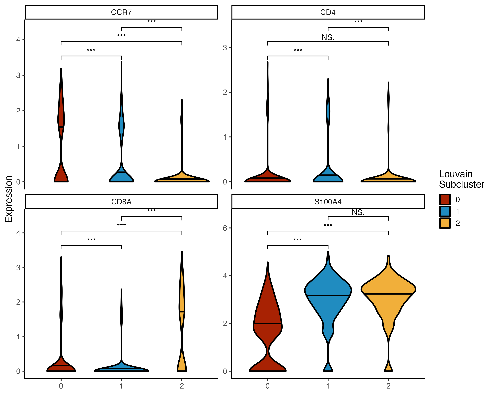
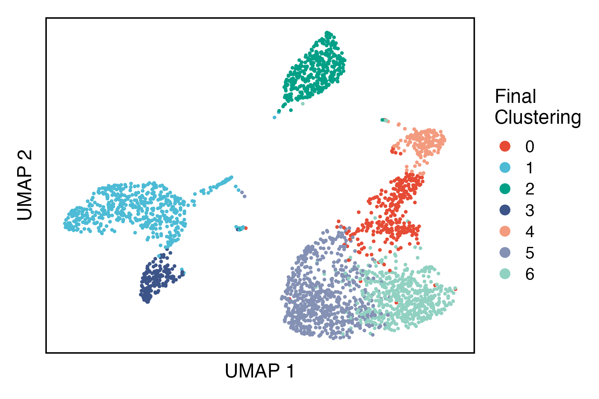

# SCISSORS

This package allows the reclustering of single cell clusters based on the identification of the highly variable genes that are unique to each cluster. Here we'll briefly describe the workflow on the classic PBMC3k dataset from 10X Genomics.

# Installation

`SCISSORS` can be installed from this repository like so:

```{r}
remotes::install_github("jr-leary7/SCISSORS")
```

# Getting Started

Here's a basic tutorial on how to get `SCISSORS` up and running (and finding cool cell subgroups for you!).

## Libraries

First, we load the necessary libraries, including `Seurat` for data structures and `SeuratData` for our example dataset.

```{r}
library(dplyr)
library(Seurat)
library(ggplot2)
library(SCISSORS)
library(SeuratData)
```

## Parallelism 

Both main functions in `SCISSORS` (`PrepareData()` and `ReclusterCells()`) support parallel processing in order to speed up operations. The `future` package is used to parallelize the `Seurat` processing code, and `foreach` is used for the main reclustering loop. While the `foreach` loop doesn't need any extra care to be used, `future` can be tricky due to its default memory limits. If you're going to use parallel processing, make sure to add this line of code at the beginning of your processing code. It increases the size of objects that can be exported to each parallel worker - but be careful to not exceed to amount of free memory on your system. Replace the `1000` with the number of MB you'd like to be able to export, e.g., `10000` is equivalent to 10GB. 

```{r}
options(future.globals.maxSize = 1000 * 1024^2)   # 1GB per worker 
options(future.globals.maxSize = 10000 * 1024^2)  # 10GB per worker 
```

## Preprocessing

Next, we use the `PrepareData()` function to pre-process our data. This function can calculate the percentage of mitochondrial DNA for each cell, select highly variable genes, normalize and scale the counts, and regress out the effect of the percentage of mitochondrial DNA as well as cell cycle effects. It then runs PCA, chooses an appropriate number of principal components using a cutoff value for the cumulative proportion of variance explained, and then performs non-linear dimension reduction using the principal component matrix as an initialization various embeddings. Finally, we create a SNN graph using the approximation *k* \~ sqrt(*n*) and generate a preliminary rough clustering of our cells using Louvain modularity optimization. Essentially, the function performs all the usual pre-processing steps commonly used in `Seurat`.

```{r}
pbmc <- LoadData("pbmc3k")
pbmc <- PrepareData(seurat.object = pbmc, 
                    n.HVG = 4000, 
                    use.parallel = FALSE, 
                    n.PC = 15, 
                    which.dim.reduc = "umap", 
                    initial.resolution = .4)
```

We can visualize the initial broad clustering on the UMAP embedding. 

```{r}
DimPlot(pbmc) + 
  paletteer::scale_color_paletteer_d("ggsci::nrc_npg") + 
  labs(x = "UMAP 1", 
       y = "UMAP 2", 
       color = "Louvain\nCluster") + 
  theme_yehlab() + 
  theme(legend.position = "right", 
        legend.direction = "vertical")
```



If you want to get the silhouette score for each cell use the following snippet. To get just the mean value for each cluster, set `avg = TRUE`. 

```{r}
sil_score_df <- ComputeSilhouetteScores(pbmc, avg = FALSE)
```

## Reclustering

While we can determine which initial clusters to subcluster, we can also do so in a supervised manner. Here we can use the canonical marker gene CD3D for T cells to identify two T cell groups in clusters 0 & 3. These two clusters will thus be our reclustering targets. 

```{r}
FeaturePlot(pbmc, 
            features = "CD3D", 
            cols = paletteer::paletteer_d("MetBrewer::Hiroshige", direction = -1)) +  
  labs(x = "UMAP 1", 
       y = "UMAP 2", 
       color = "Expression") + 
  theme_yehlab() + 
  theme(legend.position = "right", 
        legend.direction = "vertical")
```



The `ReclusterCells()` function performs the actual subpopulation-detection analysis, which is based on tuning the parameters of the Louvain modularity optimization function with the goal of maximizing the mean silhouette score of a given set of parameters. The function returns a `Seurat` object with re-normalized counts, re-identified highly variable genes, re-computed low-dimensional embeddings, and a subclustering generated by the set of parameters *k* (nearest-neighbors) and *r* (resolution) that gave the highest mean silhouette score. 

```{r}
t_reclust <- ReclusterCells(pbmc, 
                            which.clust = c(0, 3), 
                            merge.clusters = TRUE, 
                            use.parallel = FALSE, 
                            n.HVG = 4000, 
                            n.PC = 10, 
                            k.vals = c(30, 40, 50, 60), 
                            resolution.vals = c(.2, .3, .4), 
                            redo.embedding = TRUE)
```

Let's check out the re-embedding of our new subclusters. 

```{r}
DimPlot(t_reclust) + 
  paletteer::scale_color_paletteer_d("MetBrewer::Juarez") + 
  labs(x = "UMAP 1", 
       y = "UMAP 2", 
       color = "Louvain\nSubcluster") + 
  theme_yehlab() + 
  theme(legend.position = "right", 
        legend.direction = "vertical")
```



The user can decide how large of a parameter set to provide; since every combination of parameters is tested, larger parameter sets will lead to longer compute times but may give more accurate results. 

## Identifying Marker Genes

Once a satisfactory reclustering has been generated, it's common practice to identify marker genes with which to annotate the clusters. We provide a function, `FindSpecificMarkers()`, which identifies marker genes for each cluster under the constraint that those markers are not highly expressed in any of the other clusters. This is done by simply identifying marker genes for each cluster, and then filtering those markers on a per-cluster basis by genes that are expressed above a percentile cutoff in any of the other clusters. 

```{r}
t_markers <- FindSpecificMarkers(t_reclust, 
                                 ident.use = "seurat_clusters", 
                                 perc.cutoff = 0.95)
```

We'll determine identities of each of our subclusters using markers from [the Satija lab PBMC3k vignette](); CCR7 for Naive CD4+ T, S100A4 for Memory CD4+ T, and CD8A for CD8+ T. 

```{r}
GetAssayData(t_reclust, slot = "data", assay = "RNA") %>% 
  Matrix::t() %>% 
  as.data.frame() %>% 
  select(CD4, CD8A, S100A4, CCR7) %>% 
  mutate(cluster = t_reclust$seurat_clusters) %>% 
  tidyr::pivot_longer(!cluster, names_to = "gene", values_to = "expression") %>% 
  ggplot(aes(x = cluster, y = expression, fill = cluster)) + 
  facet_wrap(~gene, scales = "free_y") + 
  geom_violin(draw_quantiles = 0.5, 
              color = "black", 
              size = 1) + 
  ggsignif::geom_signif(comparisons = list(c("0", "1"), c("0", "2"), c("1", "2")), 
                        test = "wilcox.test", 
                        map_signif_level = TRUE, 
                        step_increase = 0.12, 
                        textsize = 4) + 
  paletteer::scale_fill_paletteer_d("MetBrewer::Juarez") + 
  labs(x = NULL, y = "Expression", fill = "Louvain\nSubcluster") + 
  theme_classic(base_size = 14)
```



## Re-integrating Subclusters

Lastly, once the subclusters have been identified and annotate we can add their identities back to the original `Seurat` object like so:

```{r}
pbmc_final <- IntegrateSubclusters(pbmc, t_reclust)
```

The above function also works for multiple reclustering results; just provide the list of subpopulation `Seurat` objects to the `reclust.results` argument. 

Thus, our final embedding / clustering becomes:

```{r}
DimPlot(pbmc_final) + 
  paletteer::scale_color_paletteer_d("ggsci::nrc_npg") + 
  labs(x = "UMAP 1", 
       y = "UMAP 2", 
       title = NULL, 
       color = "Final\nClustering") + 
  theme_yehlab() + 
  theme(legend.position = "right", 
        legend.direction = "vertical")
```



# Contact Information

This package is based on the ideas of Dr. Xianlu Peng (Research Assistant Professor in Dept. of Pharmacology, Lineberger Comprehensive Cancer Center, UNC Chapel Hill). The code is written and maintained by Jack Leary (Lineberger Comprehensive Cancer Center, University of Florida Department of Biostatistics). Jack can be reached on GitHub as well as at [jrleary\@live.unc.edu](mailto:jrleary@live.unc.edu) for any questions, issues, or bugs.
